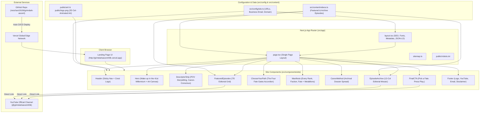

# KIẾN TRÚC HỆ THỐNG GRIMDARKASCENT (WEBSITE ARCHITECTURE)

Tài liệu chi tiết về cấu trúc kiến trúc, công nghệ và luồng dữ liệu của website **GrimdarkAscent** ([`grimdarkascent40k.vercel.app`](https://grimdarkascent40k.vercel.app)).

---

## 1. Triết Lý Thiết Kế & Nguyên Tắc Cốt Lõi (Core Principles)

Website được xây dựng theo mô hình **High-Conversion Creator Landing Page** với các nguyên tắc kiến trúc nghiêm ngặt:

1. **Zero-Backend / Zero-Database**:
   - Không sử dụng cơ sở dữ liệu (Prisma, SQLite, MongoDB), không backend API server, không authentication.
   - Toàn bộ dữ liệu (video, metadata, brand links) được quản lý dạng **Static Content** (`TypeScript constants`), giúp tốc độ phản hồi gần như tức thì (< 50ms TTFB) và chi phí vận hành $0 trên Vercel.
2. **Direct Conversion Flow**:
   - Loại bỏ video player nhúng nội bộ (inline video player) và hệ thống theo dõi tiến độ xem (watch tracking).
   - Mọi tương tác video dẫn trực tiếp người xem về kênh YouTube chính thức ([`@grimdarkascent40k`](https://www.youtube.com/@grimdarkascent40k)), tối đa hóa lượt xem, thuật toán đề xuất và đăng ký kênh.
3. **Design Taste & Anti-AI-Slop**:
   - Tuân thủ hệ thống thẩm mỹ grimdark: Tông nền tối sâu `#0B0D0F`, viền kim loại `#1F2429`, điểm nhấn màu máu `#C43A32`.
   - Ngôn ngữ hình học sắc sảo: Bán kính bo góc nghiêm ngặt `0px`, `2px`, hoặc `4px` (tuyệt đối không dùng nút hình viên thuốc `rounded-full`).
   - Kiểu chữ chuyên nghiệp: **Barlow Condensed** cho tiêu đề lớn (Display Headings), **Geist** cho nội dung đọc, và **Geist Mono** cho nhãn kỹ thuật / metadata.
4. **Hiệu năng & Khả năng tiếp cận (Performance & Accessibility)**:
   - Đạt chuẩn WCAG AA contrast (tỷ lệ tương phản tối thiểu 4.5:1).
   - 100% responsive, không tràn ngang (Zero horizontal overflow) trên mọi kích thước màn hình từ 360px đến 1920px+.
   - Hỗ trợ đầy đủ người dùng bật chế độ giảm chuyển động (`prefers-reduced-motion`).

---

## 2. Sơ Đồ Kiến Trúc Thành Phần (Component & Data Flow)



---

## 3. Cấu Trúc Thư Mục Chi Tiết (Project Structure)

```
grimdark-archive-source/
├── public/                     # Static Assets được phục vụ trực tiếp
│   ├── art/                    # 8 tác phẩm tranh minh họa 2D cel-shaded độc quyền
│   │   ├── hero-fates.png          # Hero 4 chiến binh 40K
│   │   ├── path-pov.png            # Gate 01: Lính bộ binh Krieg
│   │   ├── path-hierarchy.png      # Gate 02: Sĩ quan Hải quân Đế chế
│   │   ├── path-transformation.png # Gate 03: Biến đổi Space Marine
│   │   ├── path-worlds.png         # Gate 04: Thế giới tử địa Alien Death World
│   │   ├── fate-portraits.png      # 6 huy hiệu chân dung kim loại
│   │   ├── canon-method.png        # Hồ sơ lưu trữ quân sự cổ trên bàn sắt
│   │   └── final-transmission.png  # Đội tuần tra lúc hoàng hôn trên phế tích gothic
│   ├── icons/                  # PWA & Web icons (192px, 512px, apple-touch)
│   ├── logo.png                # Logo chính thức Tech-priest skull crest
│   ├── manifest.webmanifest    # Cấu hình PWA
│   ├── og.jpg                  # OpenGraph banner chia sẻ mạng xã hội
│   └── robots.txt              # Chỉ dẫn cho các search engine bots
├── src/
│   ├── app/                    # Next.js App Router
│   │   ├── globals.css         # Tailwind v4 configuration, theme tokens, typography
│   │   ├── icon.png            # Favicon tự động (64x64)
│   │   ├── layout.tsx          # Root HTML layout, SEO metadata, fonts
│   │   ├── not-found.tsx       # Trang 404 tùy biến chuẩn phong cách 40K
│   │   ├── page.tsx            # Trang chủ tổng hợp tất cả 9 section + Schema.org JSON-LD
│   │   └── sitemap.ts          # Bộ sinh sitemap.xml động
│   ├── components/site/        # Các UI component độc lập
│   │   ├── header.tsx              # Thanh điều hướng sticky + Logo + Youtube CTA
│   │   ├── hero.tsx                # Hero section nghệ thuật hình ảnh canvas
│   │   ├── descriptor-strip.tsx    # Dải nhãn tóm tắt phong cách kênh
│   │   ├── featured-episodes.tsx   # Cụm 3 video nổi bật (tỷ lệ 7/5)
│   │   ├── choose-your-path.tsx    # Bốn cánh cổng định mệnh (Accordion desktop, grid mobile)
│   │   ├── manifesto.tsx           # Tuyên ngôn 3 dòng so le + 6 huy hiệu chân dung
│   │   ├── manifesto-outline-line.tsx # Component hiển thị chữ viền rỗng độ tương phản cao
│   │   ├── canon-method.tsx        # Trình bày hồ sơ nguyên tắc lưu trữ
│   │   ├── episode-archive.tsx     # Lưới mosaic 6 tập gần nhất
│   │   ├── final-cta.tsx           # Kêu gọi hành động cuối trang
│   │   ├── footer.tsx              # Chân trang (Logo, link YouTube, mailto business, bản quyền)
│   │   ├── reveal.tsx              # Hiệu ứng xuất hiện cuộn trang (Framer Motion wrapper)
│   │   └── section-heading.tsx     # Tiêu đề đồng bộ cho từng phân đoạn
│   ├── config/
│   │   └── site.ts             # Cấu hình tập trung: Tên, domain, email, link YouTube, X
│   ├── content/
│   │   └── videos.ts           # Cơ sở dữ liệu danh sách video (Featured & Archive)
│   └── lib/
│       └── utils.ts            # Hàm tiện ích Tailwind merge (cn)
├── review/                     # 15 ảnh chứng minh chất lượng kiểm thử & review notes
├── scripts/                    # Scripts tự động hóa kiểm tra viewport & capture
├── ARCHITECTURE.md             # Tài liệu kiến trúc này
├── README.md                   # Hướng dẫn bảo trì và cập nhật cho tương lai
└── package.json                # Dependencies và build scripts
```

---

## 4. Công Nghệ & Thư Viện Sử Dụng (Tech Stack)

| Thành Phần | Công Nghệ / Thư Viện | Lý Do Lựa Chọn |
| :--- | :--- | :--- |
| **Framework** | Next.js 16.3.5 (App Router) | Tối ưu hóa hiệu năng, Static Site Generation (SSG), hỗ trợ Turbopack cực nhanh |
| **Styling** | Tailwind CSS v4 | Cấu hình tokens hiện đại, biên dịch CSS siêu nhẹ, loại bỏ hoàn toàn CSS thừa |
| **Animation** | Motion (`motion/react`) | Animation mượt mà đạt chuẩn 60fps, hỗ trợ `prefers-reduced-motion` tự nhiên |
| **Icons** | Phosphor Icons (`@phosphor-icons/react`) | Thư viện icon đồ họa kỹ thuật đồng bộ, chuẩn nét vẽ, không dùng emoji hoặc icon tự vẽ |
| **Typography** | `next/font/google` (Barlow Condensed, Geist, Geist Mono) | Tự động self-host font, zero layout shift (CLS = 0), không phụ thuộc vào CDN bên ngoài |
| **Image Optimization** | `next/image` + Sharp | Tự động chuyển đổi sang định dạng WebP/AVIF, responsive `srcSet`, nạp ảnh LCP có `priority` |
| **Hosting & CDN** | Vercel Global Edge Network | Tự động triển khai từ GitHub, SSL miễn phí, CDN toàn cầu tốc độ cao |

---

## 5. Bảng Màu & Hệ Thống Nhận Diện (Design Tokens)

Tất cả màu sắc được chuẩn hóa trong [`src/app/globals.css`](file:///C:/Users/pvc/Searches/Downloads/grimdark-archive-source/src/app/globals.css):

```css
--background: #0B0D0F;     /* Màu tối sâu chủ đạo toàn trang */
--surface: #111518;        /* Bề mặt thẻ, khung hình thumbnail */
--surface-elevated: #171B1F;/* Bề mặt nâng nổi, menu mở rộng */
--border: #1F2429;         /* Đường kẻ phân cách siêu mảnh 1px */
--border-strong: #282E35;  /* Viền tương tác nổi bật */
--foreground: #E8E3D9;     /* Màu chữ trắng xương (Bone) độ tương phản cao */
--muted-foreground: #8B949E;/* Màu chữ phụ xám kim loại */
--blood: #C43A32;          /* Màu đỏ máu điểm nhấn duy nhất của thương hiệu */
--blood-strong: #A82E27;   /* Màu đỏ đậm cho trạng thái hover/active */
--steel: #5E6670;          /* Màu xám kim loại cho nhãn kỹ thuật (Mono labels) */
```

---

## 6. Luồng Tự Động Hóa CI/CD (Deployment Lifecycle)

```
[Developer Edit File]
       ↓
[git commit & git push origin main]
       ↓
[GitHub Repository: moichan19106/grimdark-ascent]
       ↓ (Webhook Trigger)
[Vercel CI/CD Build Engine]
       ↓
├── 1. npm install
├── 2. next build (Turbopack SSG prerender 5 static routes)
├── 3. Kiểm tra TypeScript typecheck & ESLint
└── 4. Deploy lên Vercel Edge Network
       ↓
[Live tại https://grimdarkascent40k.vercel.app]
```

Mỗi khi bạn thực hiện thay đổi và đẩy lên nhánh `main` của GitHub, Vercel sẽ tự động phát hiện, biên dịch và cập nhật trang web chỉ trong vòng 20-30 giây mà không cần thao tác thủ công.
